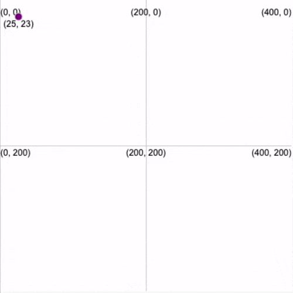

تبدأ الإحداثيات في p5 من  origin point (0،0)  في أعلى يسار الشاشة. يستخدم هذا الموقع العلوي الأيسر لـ x = 0 و y = 0 بشكل شائع عند برمجة التطبيقات والألعاب. إذا كنت قد استخدمت مخططات أو رسومات على الورق ، فقد تكون معتادًا على رؤية x = 0 و y = 0 في المنتصف.

