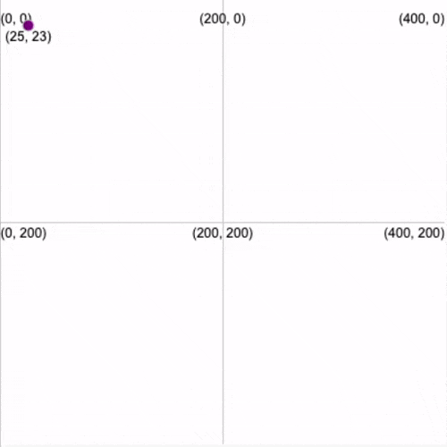

Координати в p5 починаються з  точки початку (0,0)  - з верхнього лівого кута екрана. Ця верхня ліва точка x = 0 та y = 0 використовується в більшості випадків при програмуванні додатків та ігор. Якщо ти використовував(-ла) Scratch або креслив(-ла) графіки на папері, можливо, тобі знайоме позначення x = 0 та y = 0 у центрі.

